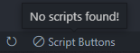

# Script Buttons for VSCode

Make running custom npm scripts easier!

## Features

When a package.json file is detected in the current workspace folder a button is created on the status bar for each script. When this button is clicked it runs the script in a terminal. Only 1 instance of each script can run at a given time.

When no package.json file is found a warning message will be displayed.

> Tip: If you have since added a package.json file clicking the refresh button will attempt to find any scripts again and update the buttons...

## Requirements

The extension will detect the presence of a package.json file and will automatically display any scripts that are present so there are no requirements.

## Extension Settings

This extension currently has no settings.

## Known Issues

There are currently no known issues.

## Release Notes

### 1.0.0

Initial release.
